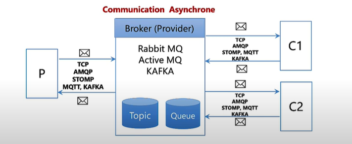
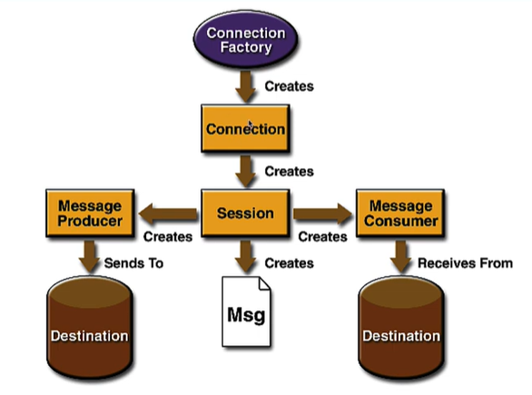

Ce répo est créé pour aidé à la compréhension de KAFKA Et de son focntionnement intérne

- pour éviter la communication REST qui est une communication bloquante entre plusieurs microservice, dans le cas des architectures distibuées, l'une des solutions les plus utilisées est l'utilisation d'un *message broker* ou un *middleware orienté message* qui permet une communication **asynchrone** 

# Architecture d'un message brocker :

est constitué de :

- un Broker ou un Provider.
- un producter qui represente les applications distribuée que l'on souhaite faire communiquer entre eux.
- un Consumer

# le modèle JMS

- JMS ou **java message service** c'est une spécification ou API qui fait partie de l'architecture JEE, 

ici l'image est celle du premier modèle JMS

